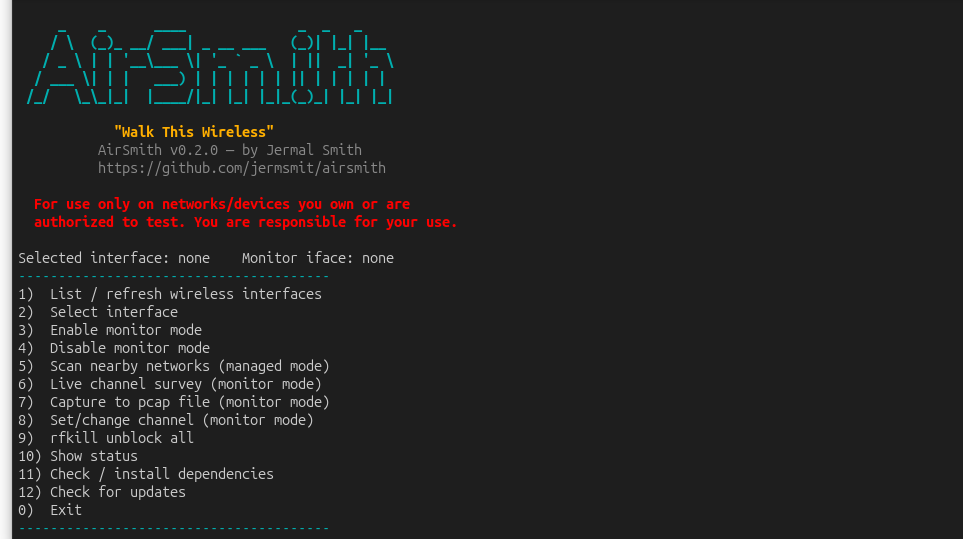

# AirSmith

**"Walk This Wireless"**

An interactive, menu-driven helper for putting Wi-Fi adapters into monitor
mode for **passive** wireless capture and analysis — no packet injection
required or assumed. Built for learning wireless fundamentals with tools
like Wireshark, tshark, and the aircrack-ng suite.

Created by Jermal Smith.



## ⚠️ Legal / Ethical Use

This tool is intended **only** for use on networks and devices you own, or
where you have explicit written authorization to test. Wireless monitoring
of networks you don't own or lack authorization for may be illegal in your
jurisdiction. You are solely responsible for how you use this tool.

## What it does

- Lists all wireless interfaces on the system (built-in and USB), their
  driver, and current mode.
- Lets you select an interface and toggle monitor mode on/off cleanly,
  handling NetworkManager conflicts automatically.
- Passive network/channel scanning:
  - Quick scan in managed mode (SSID, channel, signal, security type).
  - Live channel survey via `airodump-ng` once in monitor mode.
- Set/change the channel a monitor-mode interface is locked to.
- Save captures to `.pcap` for later analysis in Wireshark.
- Startup dependency check with optional per-tool install prompts.
- `rfkill unblock all` helper for soft-blocked adapters.

## Requirements

**Required:**
- `iw`
- `nmcli` (NetworkManager)
- `airmon-ng` / `airodump-ng` (aircrack-ng package)

**Optional (for capture/analysis):**
- `tshark`, `wireshark`, `tcpdump`
- `hcxdumptool`, `hcxtools` (for passive PMKID/handshake capture)

AirSmith checks for all of these on startup and can install missing ones
for you (with confirmation, one at a time).

## A note on packet injection

Not all Wi-Fi adapters support packet injection — notably, Intel's
`iwlwifi`-driven cards (AX200/AX201/AX210 series) support monitor mode but
**not** injection, on any OS. AirSmith is built around passive
capture/monitoring, which works fine on these cards. If you want to
experiment with injection-dependent techniques (deauth, etc.), you'll need
a separate adapter known to support injection (e.g. Atheros AR9271,
MediaTek MT7612U based USB adapters).

## Usage

```bash
git clone https://github.com/jermsmit/airsmith.git
cd airsmith
sudo bash airsmith.sh
```

Updates can be checked from within the tool itself (menu option), which
compares your local version against the `main` branch on GitHub and offers
to `git pull` if you're running from a clone.

No `chmod +x` required — running via `bash` works out of the box. If you'd
prefer to run it as `./airsmith.sh` directly, mark it executable first:

```bash
chmod +x airsmith.sh
sudo ./airsmith.sh
```

## License

GPLv3 — see [LICENSE](LICENSE).
